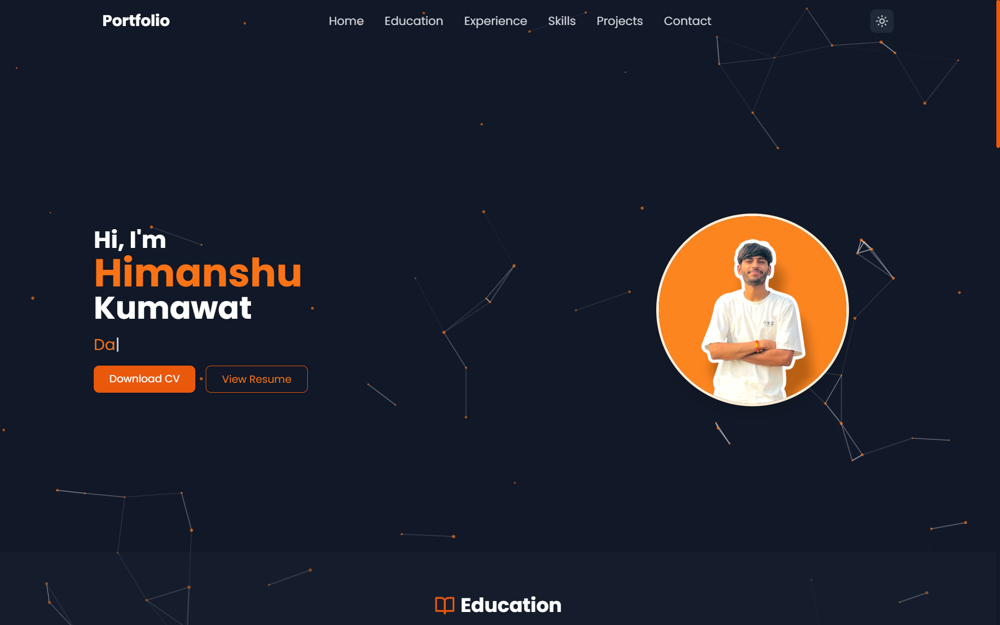
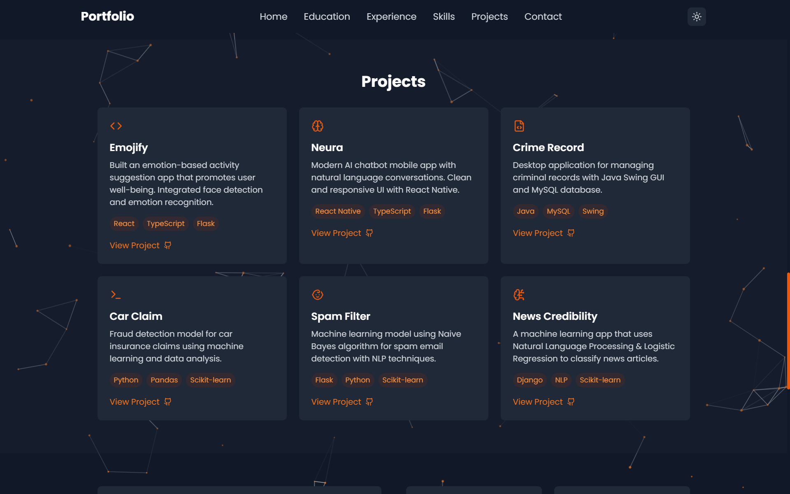
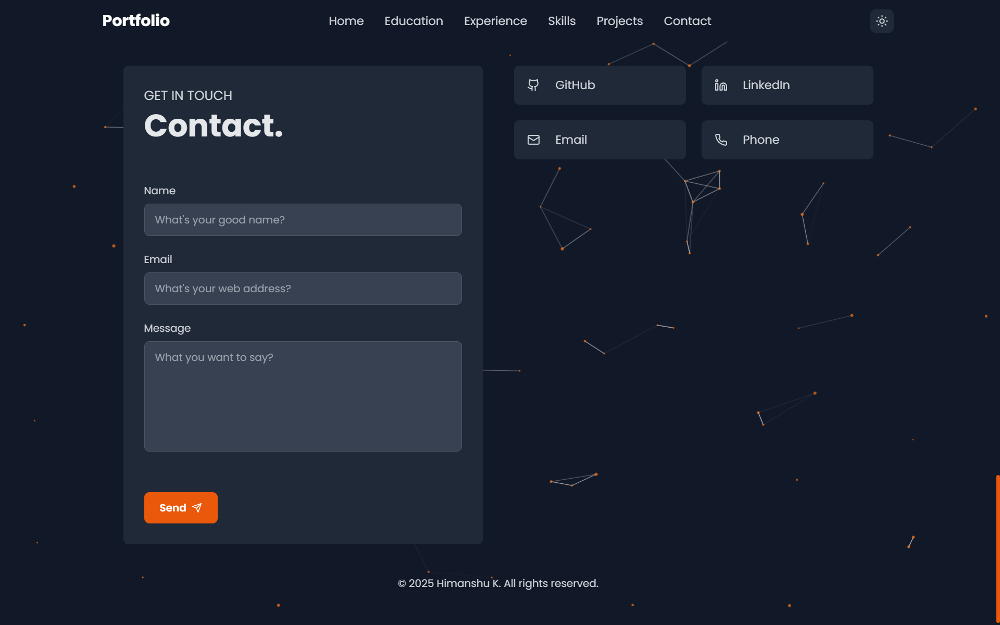
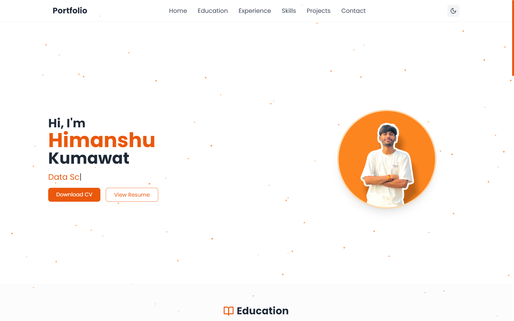

# My Portfolio

Welcome to my portfolio repository! This contains the source code for my personal website. You can visit the live site [here](https://iamhimanshu.vercel.app/).

## Screenshots

Here are some screenshots of the portfolio:

### Home



### Projects



### Contact



### Home (Light Mode)



## Features

- **Modern UI Design** with smooth navigation.
- **Responsive Layout** optimized for all devices.
- **Projects Section** showcasing my work.
- **Contact Form** for reaching out.

## Technologies Used

- **Frontend:** HTML, CSS, JavaScript, React
- **Hosting:** Vercel

## Installation & Setup

To run this project locally:

```bash
git clone https://github.com/iamhimanshu98/My-Portfolio.git
cd My-Portfolio
npm install
npm run dev
```

---

> Made with 💜 by Himanshu Kumawat.
